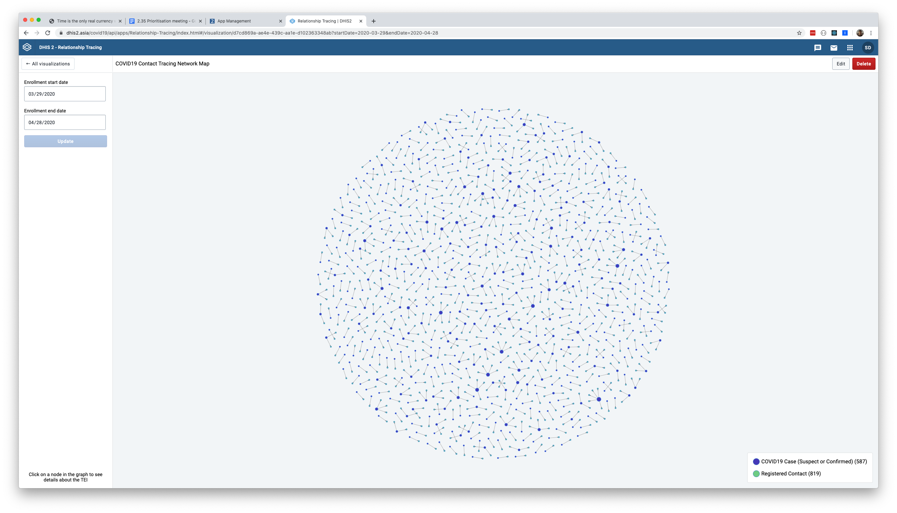

# Relationship Tracing App

A tracked entity instance relationship visualization app for [DHIS2](https://dhis2.org).

An extensive user guide is available [in the docs folder](./docs)



## Background

The COVID-19 pandemic has challenged health systems around the globe in the first half of 2020 with its rapid spread across countries, affecting the lives and health of millions of people worldwide. Health authorities require rapid public health measures to contain the disease and reduce its negative impact. Quality health information has become the key to this entire process. 

Sri Lanka was one of the first countries to adopt DHIS2 for COVID-19 surveillance in the world. In the process of customizing DHIS2 for case-based surveillance in COVID-19, contact tracing was highlighted as a main requirement. The DHIS2 data model has significant capacity to cater to case-based surveillance and contact tracing with the DHIS2 tracker functionality. However, the Ministry of Health wanted to have a visualization for public health interventions as well as epidemiological investigations which could demonstrate the possible spread of disease across a cohort of cases and their contacts. Since the native DHIS2 did not have functionality to output this visualization, HISP Sri Lanka ventured into developing a DHIS2 custom web app which works within the DHIS2 instance.

The app was initially developed by @chathurawidanage of HISP Sri Lanka and was further modified to support generic the use case of relationship mapping in case-based surveillance by @amcgee of UiO with input from DHIS2 experts.

## Prerequisites

The relationship tracing in this app depends on the relationship model in DHIS2. Therefore, it is required to configure and add relationships in DHIS2 prior to obtaining outputs using this app.
- Existing tracker program/s with tracked entity instances registered in the system
- Configuration of relationships in DHIS2
- Relationships linking tracked entity instances.

## Installation

This app is available on [the DHIS2 App Hub](https://apps.dhis2.org/app/d98a5f71-92ed-4e49-a3d5-878d18af1b1f) and can also be installed directly from the App Management app in DHIS2 instances version 2.34 and above

## Feedback & Bugs

We welcome feedback, suggestions, and collaboratio to improve the app!  Any feedback or suggestions can be submitted as [GitHub Issues](https://github.com/chathurawidanage/cor-map/issues)

## Development

Install local dependencies with `yarn install`

You can start the application locally in development mode by running `yarn start`.  The application should open on `localhost:3000` and present a dialog which allows you to select the target DHIS2 server and log in with credentials.

> NOTE: Login will fail if the domain `http://localhost:3000` isn't listed in the CORS whitelist for the given DHIS2 instance!  The CORS whitelist can be edited from the System Settings application, under the Access tab.  You can also use wildcards, for instance `http://localhost:*` if you'd like.

The server you select is "sticky", so the next time you visit `http://localhost:3000` it will use an active session for the selected server (if one exists).  To clear this, simply log out from the link in the Headerbar, return to `http://localhost:3000`, and log in to a different server.

## Production Build

You can create a production build simply by running:

```
> yarn build
```

This creates a set of static files in `build/app` and also automatically generates a flat `.zip` file in `build/bundle` which can be uploaded directly to a DHIS2 instance using the App Management App, or uploaded to the [DHIS2 App Store](https://play.dhis2.org/appstore).
